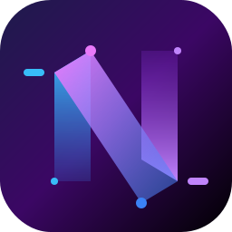

# Navexa AI 🚀
### Next-Generation Multi-Mode Intelligent Platform

Navexa AI is a high-fidelity conversational platform built with **React**, **Node.js**, and **Tailwind CSS**. It leverages the power of **Google Gemini 1.5 Flash** to provide a seamless, multi-modal intelligence experience including Chat, Research, and Coding modes.



## ✨ Features
- **🧠 Intelligent Auto-Detection**: Backend automatically classifies prompts into Chat, Research, or Coding workflows.
- **💻 Advanced Coding Mode**: Structured responses with syntax highlighting, language detection, and one-click code copying.
- **🔍 Deep Research Mode**: Comprehensive analysis with overviews, key findings, and concluding insights.
- **🎨 Premium UI/UX**: Futuristic dark mode aesthetic, glassmorphism effects, and smooth Framer-like animations.
- **📱 Fully Responsive**: Optimized for Desktop, Tablet, and Mobile with a dedicated slide-out sidebar and touch-friendly controls.
- **🔒 Secure Auth & Profile**: Integrated Firebase Authentication with Cloudinary-backed profile management (including automatic cleanup of old images).

## 🛠️ Tech Stack
- **Frontend**: Vite, React, Tailwind CSS, Lucide Icons, Axios, Prism.js.
- **Backend**: Node.js, Express, Google Generative AI (Gemini SDK), Nodemailer, Cloudinary.
- **Infrastructure**: Firebase Auth, GitHub Actions (optional).

## 🚀 Getting Started

### 1. Clone & Install
```bash
git clone https://github.com/Demo0655/Navexa_AI.git
cd Navexa_AI
```

### 2. Backend Setup
1. Navigate to `/backend`
2. Create a `.env` file:
   ```env
   GOOGLE_AI_API_KEY=your_key
   CLOUDINARY_CLOUD_NAME=your_name
   CLOUDINARY_API_KEY=your_key
   CLOUDINARY_API_SECRET=your_secret
   PORT=5000
   ```
3. Run `npm install && npm start`

### 3. Frontend Setup
1. Navigate to `/frontend`
2. Create a `.env` file:
   ```env
   VITE_API_URL=http://localhost:5000/api
   ```
3. Run `npm install && npm run dev`

## 🌍 Deployment
To make Navexa AI live:
1. **Backend**: Host the `backend` folder on **Render** or **Railway**.
2. **Frontend**: Host the `frontend` folder on **Vercel** or **Netlify**.
3. **ENV**: Remember to set your `VITE_API_URL` on Vercel to point to your live Render/Railway URL.

---
Built with ❤️ by [Demo0655](https://github.com/Demo0655)

